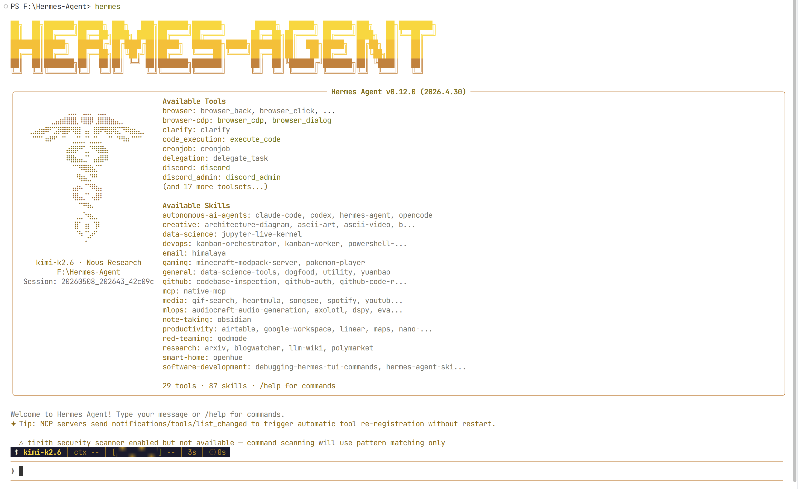
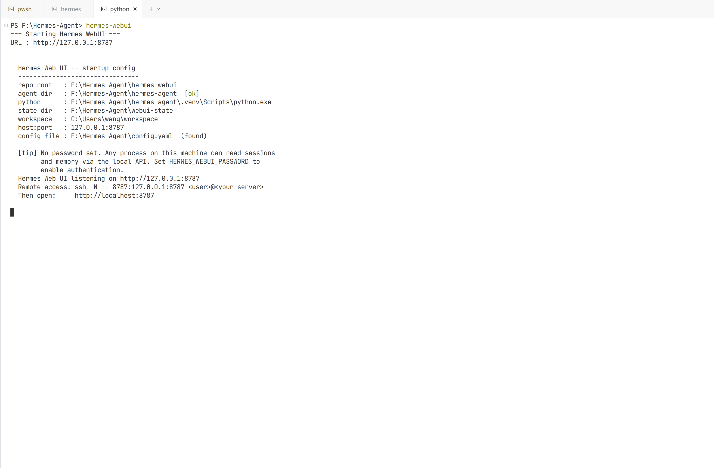
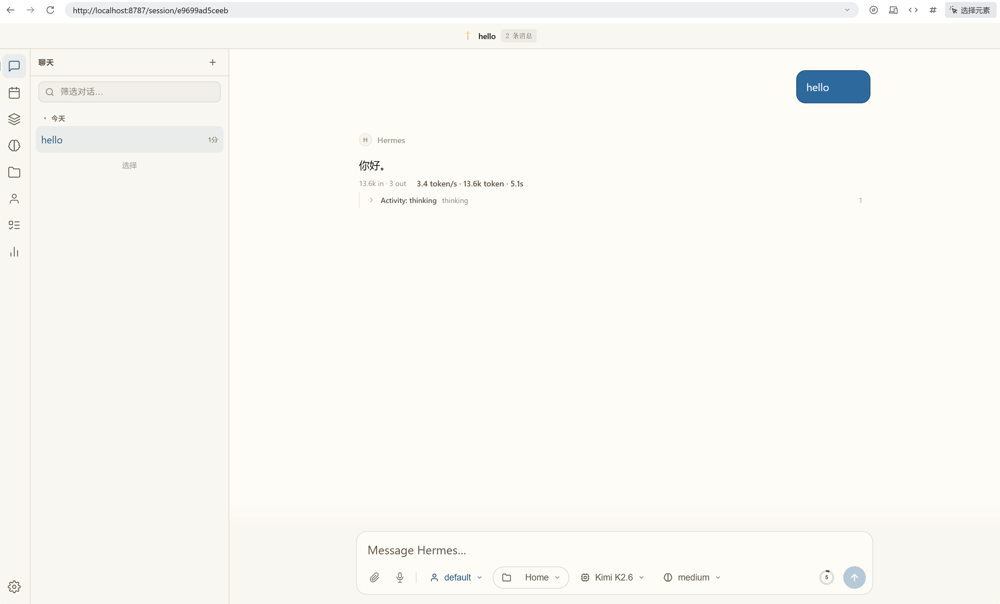
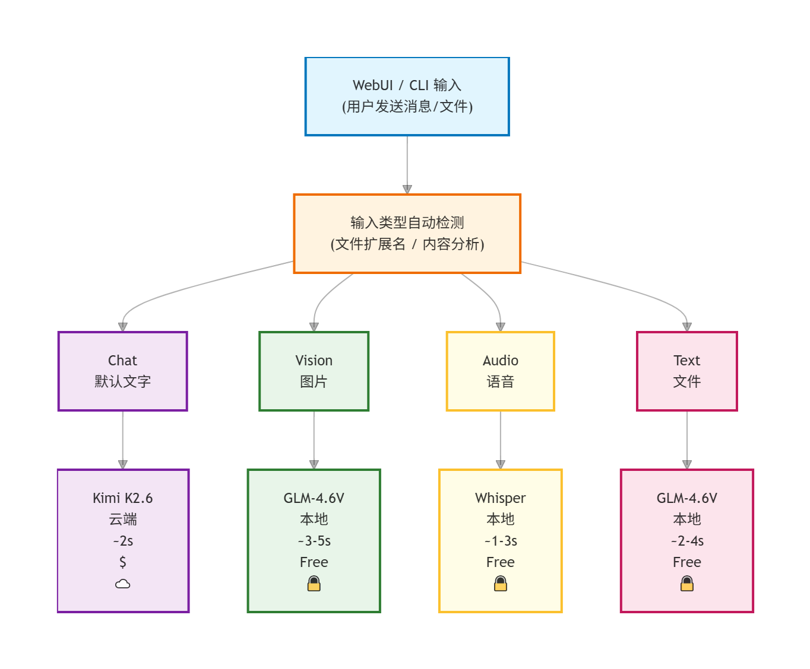
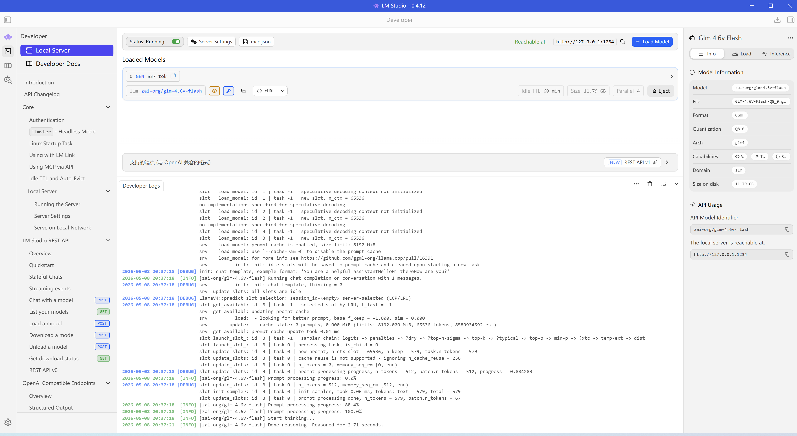

# 🚀 Hermes Windows Native

**[English](README.md) | 🇨🇳 中文**

[](LICENSE)
[](https://www.python.org/downloads/)
[]
[](https://github.com/markwang2658/hermes-windows-native)
[](https://github.com/markwang2658/hermes-windows-native)

## 🖥️ 在你的 Windows 原生运行的 AI 智能体 — No Docker · No WSL2

> **Hermes Agent + WebUI。原生 Windows。零开销。**

---

## 🎯 为什么选择 Windows 原生版？

官方 Hermes 技术栈要求你在 Windows 上安装 **Docker 或 WSL2**。

**这意味着还没开始用，就已经吃掉了 500MB–2GB 的内存。**

本项目彻底解决了这个问题：

| | Docker（官方） | WSL2（官方） | **Hermes Windows Native** ⭐ |
|---|---|---|---|
| **内存占用** | ~500 MB | ~1–2 GB | **~50 MB** ✅ |
| **配置复杂度** | 中等 | 较高 | **低** ✅ |
| **需要虚拟机？** | 是（容器） | 是（Linux） | **否** ✅ |
| **8GB 内存能跑？** | 勉强 | 吃力 | **轻松** ✅ |
| **安装时间** | 10–30 分钟 | 20–60 分钟 | **< 5 分钟** ✅ |

### 你能得到什么

- 🚀 **比 Docker 省约 250MB 内存** — 可以同时运行其他程序
- 💾 **比 WSL2 省约 750MB–1.9GB 内存** — 用的是你的机器，不是机器里的虚拟机
- ⚡ **冷启动更快** — 没有容器/虚拟机的启动延迟
- 🔧 **调试更方便** — 原生进程、原生工具、一切都是原生的

---

## ⚡ 快速开始 — 3 条命令，3 分钟搞定

```powershell
# 1. 克隆仓库
git clone https://github.com/markwang2658/hermes-windows-native.git
cd hermes-windows-native

# 2. 安装（自动检测 Python、创建虚拟环境、安装依赖）
.\install.ps1

# 3. 启动
.\start.ps1
```

然后在浏览器中打开 http://127.0.0.1:8787

🎉 就这样。**不用 Docker。不用 WSL2。不用折腾配置。**


*图：克隆 → 安装 → 启动 — 3 分钟内即可运行*

---

## ✨ 功能特性

### 🧠 AI 智能体核心（来自 [NousResearch/hermes-agent](https://github.com/NousResearch/hermes-agent)）

- **持久化记忆** — 跨会话记住对话内容，随时间积累上下文
- **定时任务（Cron）** — 离线时也能自动执行计划任务
- **多模型支持** — OpenAI、Anthropic、Google Gemini、DeepSeek、Kimi、Ollama（本地）、Groq...
- **自进化技能** — 自动创建、测试和优化自己的工具集
- **工具生态** — 浏览器自动化、终端操作、文件编辑、网页搜索、代码执行...



*图：Hermes Agent 终端启动 — 自动加载技能、连接模型网关、就绪待命*

### 🌐 Web 界面（来自 [nesquena/hermes-webui](https://github.com/nesquena/hermes-webui)）

- **完整聊天界面** — 对话历史、流式响应、Markdown 渲染
- **工作区浏览器** — 浏览文件、编辑代码、内置 Git 集成
- **会话管理** — 多会话支持、搜索、导出/导入
- **7 种主题配色** — Dark、Light、Nord、Monokai、OLED、Solarized...
- **设置面板** — 模型选择、供应商配置、主题切换



*图：Hermes WebUI 三栏布局 — 会话列表、聊天区域、工作区浏览器*

### 🖥️ Windows 原生优势（本项目独有）

- **一键安装** — `install.ps1` 全自动处理（不用手动建 venv、不用跟 pip 打架）
- **一键启动** — `start.ps1` 自动检测 Agent、设置环境变量、启动服务
- **原生性能** — 你和 AI 之间没有虚拟化层
- **低资源占用** — 8GB 内存机器上仅占 ~330MB（WSL2 方案则需 ~1080MB）
- **PowerShell 原生** — 所有脚本均为 `.ps1`，无需 bash/shell 兼容 hack



*图：Hermes Agent 实时对话 — 流式响应、Markdown 渲染、多轮上下文*

---

## 🏗️ 系统架构



*图：Hermes 根据输入类型（聊天/图片/语音/文本）自动路由到最佳 AI 模型*

## 📁 项目结构

```
hermes-windows-native/
├── hermes-agent/          # AI 智能体核心（记忆、技能、定时任务、网关）
├── hermes-webui/          # 浏览器界面（聊天、工作区、会话、主题）
├── install.ps1            # 一键安装脚本
├── start.ps1              # 一键启动脚本
├── README.md              # 英文说明文档（本文件）
└── LICENSE                # MIT 许可证
```

---

## 💾 内存对比

在 **8GB 内存的机器**上运行：

| 组件 | Docker | WSL2 | **原生版（本方案）** |
|-----------|--------|------|-------------------|
| 基础占用 | ~300 MB | ~800 MB | **~50 MB** |
| Agent 进程 | ~200 MB | ~200 MB | ~200 MB |
| WebUI 服务 | ~80 MB | ~80 MB | ~80 MB |
| **总计** | **~580 MB** | **~1080 MB** | **~330 MB** |

> **比 Docker 省约 250MB，比 WSL2 省约 750MB。** 在 8GB 机器上，这很重要。

---

## 🤖 本地模型推理



*图：LM Studio 界面 — 搜索、下载并运行本地 AI 模型（GLM-4.6V 用于图片/文本理解）*

> **隐私优先**：图片、语音和文件均在你的本地机器上处理，数据不会外传。

---

## 🔧 系统要求

- **Windows 10 (1809+) 或 Windows 11**
- **Python 3.10+** ([下载](https://www.python.org/downloads/))
  - 安装时：✅ 务必勾选 **"Add Python to PATH"**
- **约 500MB 可用磁盘空间**（用于安装依赖）

---

## 🛠️ 常见问题

| 问题 | 解决方法 |
|---------|-----|
| `python: command not found` | 安装 Python 3.10+，勾选 "Add to PATH" |
| 端口 8787 已被占用 | `.\start.ps1 -Port 8788` |
| 模块导入错误 | 重新运行 `.\install.ps1` |
| 未检测到 Agent | 在 `start.ps1` 中手动设置 `$env:HERMES_WEBUI_AGENT_DIR` |
| Push 超时失败 | 检查网络代理设置，或稍后重试 |

---

## 🗺️ 开发路线图

- [x] 初始版本发布：统一仓库 + PowerShell 脚本
- [ ] **Windows 适配修复** — POSIX 路径 → Windows 路径、fcntl 文件锁、Unix 域套接字
- [ ] **引导流程优化** — 跳过 `bootstrap.py` 中的 WSL 检测，直接走原生路径
- [ ] **CI/CD** — GitHub Actions Windows runner 自动测试
- [ ] **发布构建** — 便携式 zip 包，一键下载运行
- [x] **中文版 README** (`README.zh-CN.md`) ← 你正在看的这个

---

## 🤝 参与贡献

发现了 Bug？有好主意？

- 🐛 [提交 Issue](https://github.com/markwang2658/hermes-windows-native/issues) — 错误报告、功能请求
- 💻 [Pull Request](https://github.com/markwang2658/hermes-windows-native/pulls) — 欢迎代码贡献！
- 💬 [讨论区](https://github.com/markwang2658/hermes-windows-native/discussions) — 提问、交流、闲聊

详细指南请参阅 [CONTRIBUTING.md](hermes-webui/CONTRIBUTORS.md)。

---

## 📜 许可证

MIT 许可证 — 详见 [LICENSE](LICENSE)。

原始作品来自：
- [NousResearch](https://github.com/NousResearch) — [hermes-agent](https://github.com/NousResearch/hermes-agent)
- [nesquena](https://github.com/nesquena) — [hermes-webui](https://github.com/nesquena/hermes-webui)

本项目是对他们作品的 **Windows 原生 Fork / 适配版本**，遵循相同的 MIT 条款分发。
